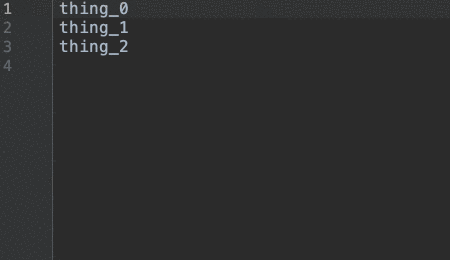

# Evaluate Arithmetic  

A plugin for IntelliJ IDEs. Download [here](https://plugins.jetbrains.com/plugin/13778-evaluate-arithmetic).



## Extended syntax for multi caret operations:
### The symbol '#' represents the index of the selection 
                                                      
    Line # 
    Line #

evaluates to

    Line 1 
    Line 2


### The symbol '$' represents value of the previus evaluation

    $+1 = 
    $+2 = 
    $+3 = 

evaluates to

    0+1 =1
    1+2 =3
    3+3 =6

### Hexadecimal numbers are accepted

    0x123 + 9

evaluates to

    300
    
    


## Building
To build the plugin and run tests, run:
 ```
./gradlew build
```
Find the generated plugin in `build/distributions` as a .zip file
